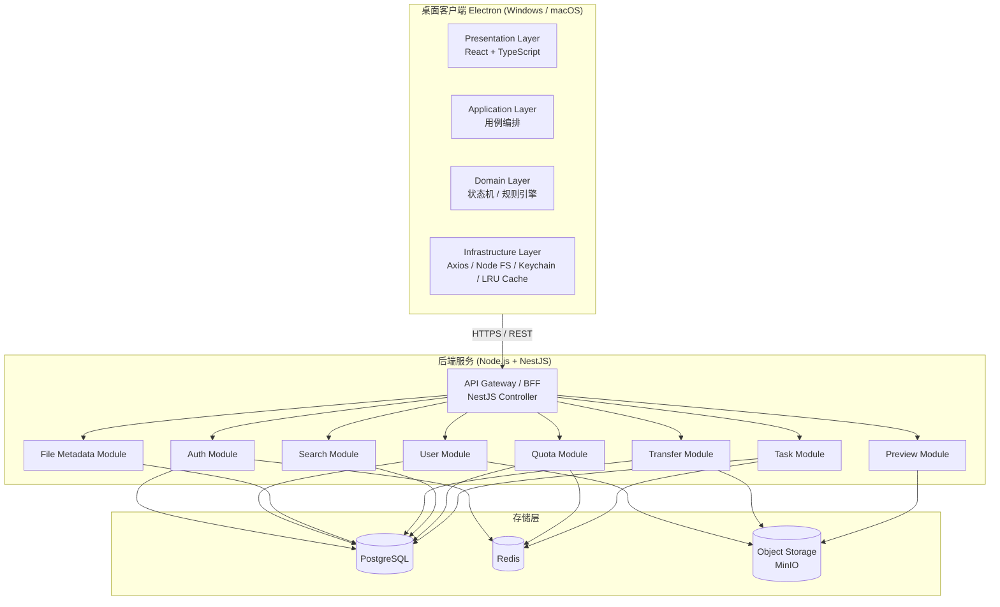
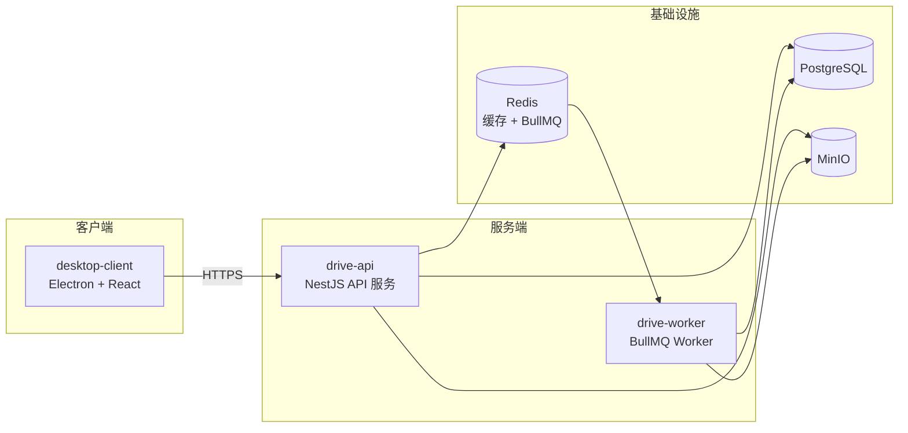
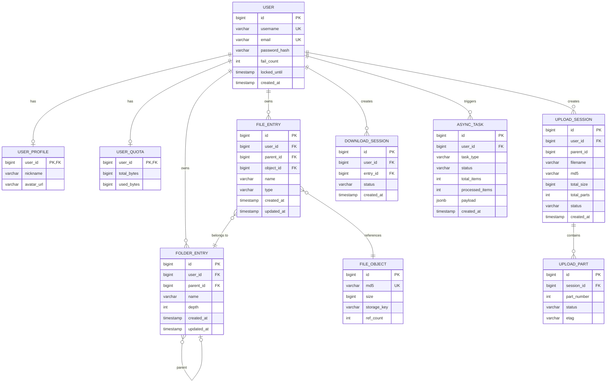
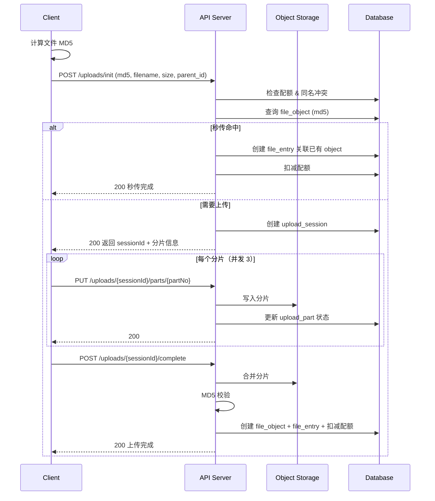
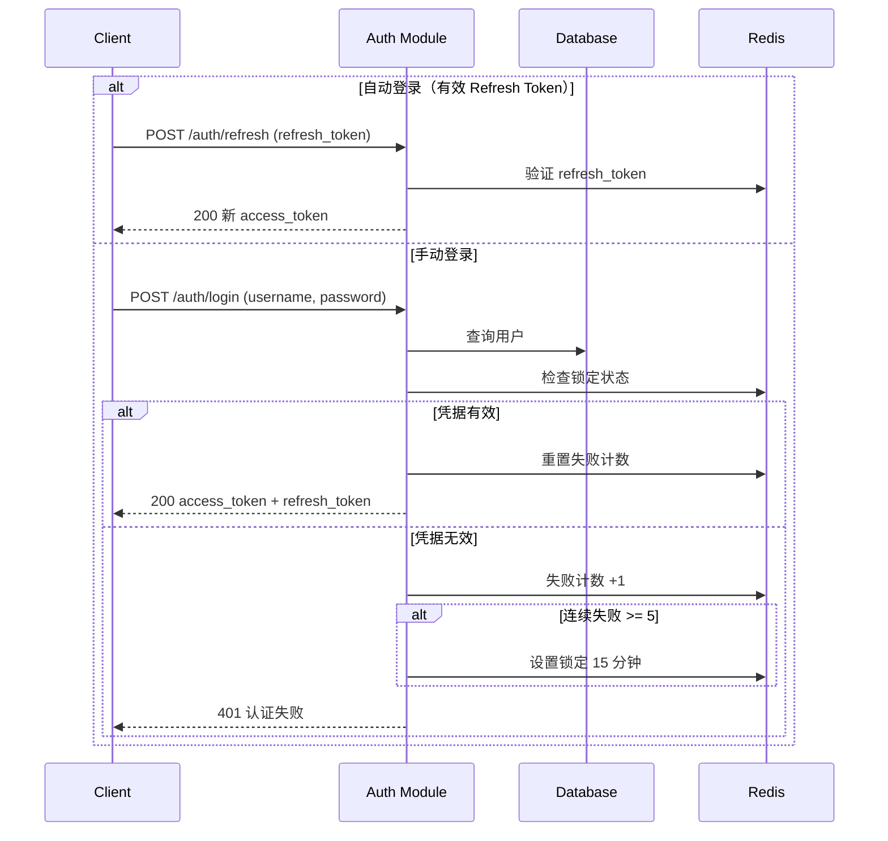

# 设计文档：个人网盘系统（MVP）

## 概述

个人网盘系统 MVP 版本，以桌面客户端（Windows/macOS）形态交付，提供用户注册登录、文件上传下载（分片/断点续传/秒传）、文件夹管理、文件搜索与预览、存储空间管理等核心能力。

系统采用「客户端 + 后端 API + 对象存储」三层架构，后端以模块化单体方式组织，大文件传输与批量操作走异步化处理，确保海量文件场景下的可用性与性能。

## 系统架构

### 整体架构图



### 部署架构图



## 组件与接口

### 客户端核心组件

| 组件            | 职责                                                             |
| --------------- | ---------------------------------------------------------------- |
| Auth Client     | 登录态管理、自动登录、Token 刷新、安全存储凭据                   |
| Upload Engine   | 分片上传、断点续传、秒传预检、MD5 计算、并发调度、暂停/恢复/取消 |
| Download Engine | 分片下载、断点续传、完整性校验、临时文件清理                     |
| File Explorer   | 文件列表分页、排序、搜索、预览入口、批量操作                     |
| Transfer Center | 统一传输任务列表、进度展示、失败重试                             |

### 服务端模块

| 模块                 | 职责                                        | 依赖存储  |
| -------------------- | ------------------------------------------- | --------- |
| Auth Module          | 注册、登录、Token 签发/刷新/失效、失败锁定  | DB, Redis |
| User Module          | 昵称、头像、密码修改                        | DB, OSS   |
| File Metadata Module | 文件/文件夹树、CRUD、移动/复制、排序分页    | DB        |
| Transfer Module      | 上传/下载会话、分片管理、合并校验、秒传判定 | DB, OSS   |
| Search Module        | 全盘文件名模糊检索（不区分大小写）          | DB        |
| Preview Module       | 图片/文档预览策略与地址生成                 | OSS       |
| Quota Module         | 配额校验、空间统计、90% 告警                | DB, Redis |
| Task Module          | 批量操作异步化（>1000 文件）                | Redis, DB |

### API 接口分组

```
鉴权与用户
  POST   /auth/register
  POST   /auth/login
  POST   /auth/refresh
  POST   /auth/logout
  GET    /me
  PUT    /me
  POST   /me/password
  POST   /me/avatar

文件与文件夹
  GET    /files                    -- 分页、排序、目录浏览
  POST   /folders
  PATCH  /entries/{id}             -- 重命名 / 移动
  POST   /entries/copy
  DELETE /entries/{id}
  GET    /entries/{id}/detail

传输
  POST   /uploads/init
  PUT    /uploads/{sessionId}/parts/{partNo}
  POST   /uploads/{sessionId}/complete
  POST   /uploads/{sessionId}/cancel
  POST   /downloads/init
  GET    /downloads/{sessionId}/parts/{partNo}

预览与搜索
  GET    /preview/{entryId}
  GET    /search?keyword=&cursor=

空间与任务
  GET    /quota
  GET    /storage/distribution
  GET    /tasks/{taskId}
```

## 数据模型

### ER 关系图



### 核心实体说明

| 实体                         | 说明                                                        |
| ---------------------------- | ----------------------------------------------------------- |
| user                         | 账号信息、安全属性（密码哈希、失败计数、锁定时间）          |
| user_profile                 | 昵称、头像等展示信息                                        |
| user_quota                   | 总配额（默认 10GB）、已用空间                               |
| file_object                  | 物理文件对象（MD5、大小、存储位置、引用计数），支持秒传去重 |
| file_entry                   | 逻辑文件记录（名称、父目录、关联 object），用户维度         |
| folder_entry                 | 目录节点（名称、父目录、深度），支持嵌套上限 20 层          |
| upload_session / upload_part | 上传会话与分片状态，支持断点续传                            |
| download_session             | 下载会话与校验状态                                          |
| async_task                   | 批量异步任务（移动/删除/复制 >1000 文件）                   |

### 关键索引方向

- 文件列表：`(user_id, parent_id, type, updated_at)` 复合索引
- 搜索：`(user_id, lower(name))` 支持不区分大小写的模糊匹配
- 秒传：`file_object.md5` 唯一索引

## 客户端本地存储

### 存储方案

客户端使用 better-sqlite3（嵌入式 SQLite）在本地持久化上传/下载任务信息，用于断点续传和传输历史记录。SQLite 数据库文件存放在 Electron `app.getPath('userData')` 目录下，文件名为 `transfer.db`。

选择 better-sqlite3 的原因：

- 上传/下载任务需要记录每个分片的状态，数据量可能较大
- SQLite 查询能力强，适合按状态查询和分片级别记录
- 同步 API，在 Electron 主进程中使用简单可靠
- 嵌入式数据库，无需额外安装和维护

### 本地数据库表设计

#### local_upload_task（上传任务表）

| 字段             | 类型     | 说明                                                        |
| ---------------- | -------- | ----------------------------------------------------------- |
| task_id          | TEXT PK  | 上传任务唯一标识（UUID）                                    |
| file_path        | TEXT     | 本地源文件路径                                              |
| target_parent_id | INTEGER  | 目标目录 ID                                                 |
| filename         | TEXT     | 文件名                                                      |
| file_size        | INTEGER  | 文件大小（字节）                                            |
| md5              | TEXT     | 文件 MD5 值                                                 |
| status           | TEXT     | 任务状态：pending / uploading / paused / completed / failed |
| session_id       | TEXT     | 服务端上传会话 ID（init 后获得）                            |
| total_parts      | INTEGER  | 总分片数                                                    |
| completed_parts  | INTEGER  | 已完成分片数                                                |
| created_at       | DATETIME | 创建时间                                                    |
| updated_at       | DATETIME | 最后更新时间                                                |

#### local_upload_part（上传分片表）

| 字段        | 类型    | 说明                                  |
| ----------- | ------- | ------------------------------------- |
| task_id     | TEXT FK | 关联上传任务 ID                       |
| part_number | INTEGER | 分片序号                              |
| status      | TEXT    | 分片状态：pending / uploaded / failed |
| etag        | TEXT    | 上传成功后服务端返回的 ETag           |

主键：`(task_id, part_number)` 复合主键

#### local_download_task（下载任务表）

| 字段            | 类型     | 说明                                                          |
| --------------- | -------- | ------------------------------------------------------------- |
| task_id         | TEXT PK  | 下载任务唯一标识（UUID）                                      |
| entry_id        | INTEGER  | 云端文件条目 ID                                               |
| filename        | TEXT     | 文件名                                                        |
| file_size       | INTEGER  | 文件大小（字节）                                              |
| save_path       | TEXT     | 本地保存路径                                                  |
| status          | TEXT     | 任务状态：pending / downloading / paused / completed / failed |
| total_parts     | INTEGER  | 总分片数                                                      |
| completed_parts | INTEGER  | 已完成分片数                                                  |
| created_at      | DATETIME | 创建时间                                                      |
| updated_at      | DATETIME | 最后更新时间                                                  |

#### local_download_part（下载分片表）

| 字段        | 类型    | 说明                                    |
| ----------- | ------- | --------------------------------------- |
| task_id     | TEXT FK | 关联下载任务 ID                         |
| part_number | INTEGER | 分片序号                                |
| status      | TEXT    | 分片状态：pending / downloaded / failed |
| temp_path   | TEXT    | 分片临时文件路径                        |

主键：`(task_id, part_number)` 复合主键

### 数据清理策略

- 已完成任务（status = completed）保留 30 天后自动清理，由客户端启动时和定时任务（每 24 小时）触发清理检查
- 分片记录（local_upload_part / local_download_part）在对应任务状态变为 completed 后立即清理，仅保留任务主记录用于历史展示
- 用户取消的任务（通过 UI 删除）立即清理任务记录及关联分片记录

## 关键流程

### 文件上传时序



### 登录认证时序



## 错误处理

| 场景       | 策略                                               |
| ---------- | -------------------------------------------------- |
| 网络断开   | 客户端显示离线状态，网络恢复后自动重连             |
| 请求超时   | 默认 30s 超时，指数退避重试最多 3 次               |
| 上传中断   | 记录已上传分片，网络恢复后断点续传                 |
| 下载中断   | 记录已下载分片，网络恢复后断点续传                 |
| 取消上传   | 通知服务端清理已上传分片，释放临时存储             |
| 取消下载   | 客户端清理本地临时分片数据                         |
| 同名冲突   | 拒绝操作并提示用户，批量场景跳过冲突项继续处理其余 |
| 配额不足   | 拒绝上传/复制，提示用户清理空间                    |
| Token 过期 | 自动使用 Refresh Token 刷新，刷新失败跳转登录      |

## 测试策略

### 单元测试

- 上传/下载状态机转换
- 同名冲突规则判定
- 配额校验逻辑
- 密码强度校验

### 集成测试

- 分片上传完整链路（init → parts → complete）
- 秒传链路（MD5 命中 → 关联 → 配额扣减）
- 搜索分页链路
- Token 刷新链路

### 端到端测试

- 注册 → 登录 → 上传 → 搜索 → 预览 → 下载 → 删除

### 性能测试

- 20GB 大文件上传
- 万级目录分页与排序
- 搜索响应 P95 ≤ 1s

## 性能考量

- 文件列表分页加载（每页 100 条），客户端本地 LRU 缓存（100MB 上限）
- 搜索首屏目标 P95 ≤ 1s，图片预览 P95 ≤ 2s
- 批量操作 >1000 文件走异步任务队列，避免阻塞主请求
- 上传/下载默认 3 并发，分片大小 5MB

## 安全考量

- 密码哈希存储（bcrypt/argon2 + 盐）
- Token 短期有效（Access 2h）+ Refresh 轮换（30d）
- 退出登录时 Access Token 加入失效列表
- 凭据使用系统安全存储（macOS Keychain / Windows Credential Manager）
- 接口鉴权、限流、防暴力登录（5 次失败锁定 15 分钟）

## 技术栈

### 前端（桌面客户端）

| 技术           | 版本/说明 | 用途                                                    |
| -------------- | --------- | ------------------------------------------------------- |
| Electron       | ≥ 41      | 桌面容器，提供跨平台窗口、系统托盘、原生菜单            |
| React          | 19.x      | UI 框架，组件化构建界面                                 |
| TypeScript     | ≥ 5.9     | 类型安全，前后端统一语言（6.0 RC 已发布，稳定后可升级） |
| Electron Forge | ≥ 7       | Electron 官方脚手架，项目初始化、打包分发、代码签名     |
| Webpack        | ≥ 5       | 构建工具（Forge Webpack 插件，稳定成熟），HMR 开发体验  |
| Zustand        | -         | 轻量状态管理                                            |
| React Router   | ≥ 6       | 客户端路由                                              |
| Ant Design     | 6.3.x     | UI 组件库                                               |
| Axios          | -         | HTTP 请求                                               |
| electron-store | -         | 本地持久化配置                                          |
| better-sqlite3 | -         | 嵌入式 SQLite，客户端本地持久化传输任务与分片状态       |
| keytar         | -         | 系统安全凭据存储（Keychain / Credential Manager）       |

### 后端（API 服务 + Worker）

| 技术               | 版本/说明 | 用途                                               |
| ------------------ | --------- | -------------------------------------------------- |
| Node.js            | ≥ 24 LTS  | 运行时（24.14.0 为当前最新 LTS）                   |
| NestJS             | ≥ 11      | 后端框架，模块化架构，依赖注入（v12 预计 Q3 2026） |
| TypeScript         | ≥ 5.9     | 类型安全，前后端统一语言                           |
| Prisma             | ≥ 6       | ORM，声明式 Schema，类型安全，数据库迁移           |
| Passport.js + JWT  | -         | 认证策略与 Token 管理                              |
| BullMQ             | -         | 基于 Redis 的任务队列（替代独立 MQ）               |
| Multer             | -         | 文件上传中间件                                     |
| @aws-sdk/client-s3 | v3        | MinIO 对象存储 SDK（S3 兼容协议）                  |
| class-validator    | -         | DTO 参数校验                                       |
| bcrypt             | -         | 密码哈希                                           |
| ioredis            | -         | Redis 客户端                                       |
| pino               | -         | 高性能结构化 JSON 日志（配合 nestjs-pino）         |

### 基础设施

| 技术                    | 用途                                            |
| ----------------------- | ----------------------------------------------- |
| PostgreSQL ≥ 17         | 元数据存储（18.x 已发布，可选用）               |
| Redis ≥ 8               | 会话/Token/锁定状态/配额缓存/任务队列（BullMQ） |
| MinIO                   | 文件内容存储                                    |
| Docker + Docker Compose | 本地开发与部署                                  |
| pnpm                    | 包管理器（Monorepo 工作区）                     |

### 工程化

| 技术              | 用途                                      |
| ----------------- | ----------------------------------------- |
| pnpm workspace    | Monorepo 管理（client / server / shared） |
| ESLint + Prettier | 代码规范                                  |
| Vitest            | 单元测试                                  |
| Playwright        | E2E 测试                                  |
| GitHub Actions    | CI/CD                                     |

## 依赖

上述技术栈中的核心运行时依赖汇总：

| 依赖                          | 用途                         |
| ----------------------------- | ---------------------------- |
| Electron + React + TypeScript | 桌面客户端 UI 框架           |
| Node.js + NestJS + TypeScript | 后端 API 服务                |
| BullMQ                        | 异步任务队列（基于 Redis）   |
| PostgreSQL                    | 元数据存储                   |
| Redis                         | 会话/Token/锁定状态/配额缓存 |
| MinIO                         | 文件内容存储                 |
