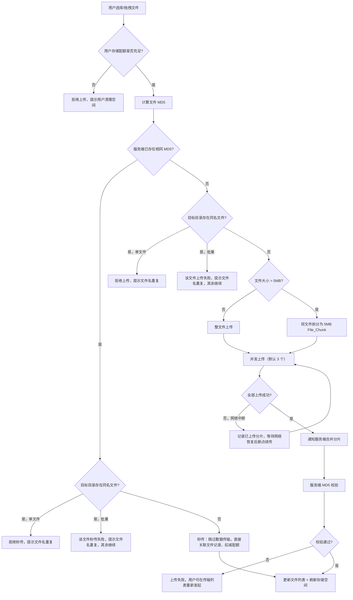
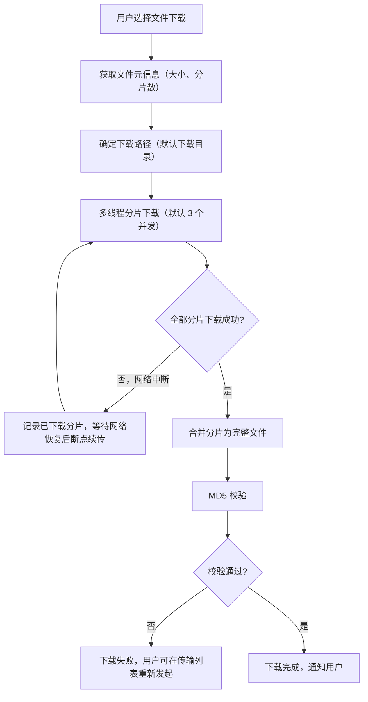
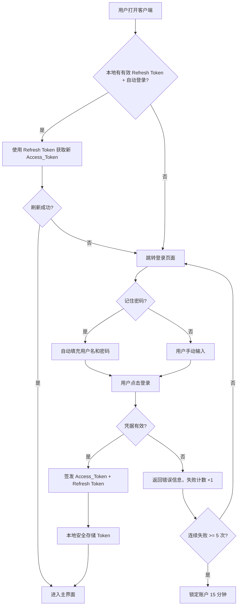
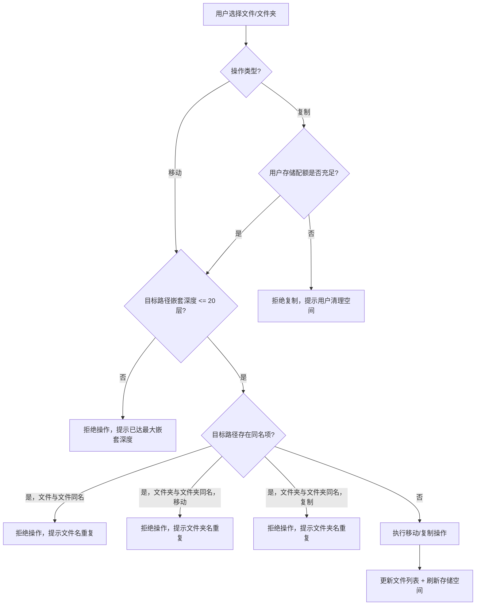
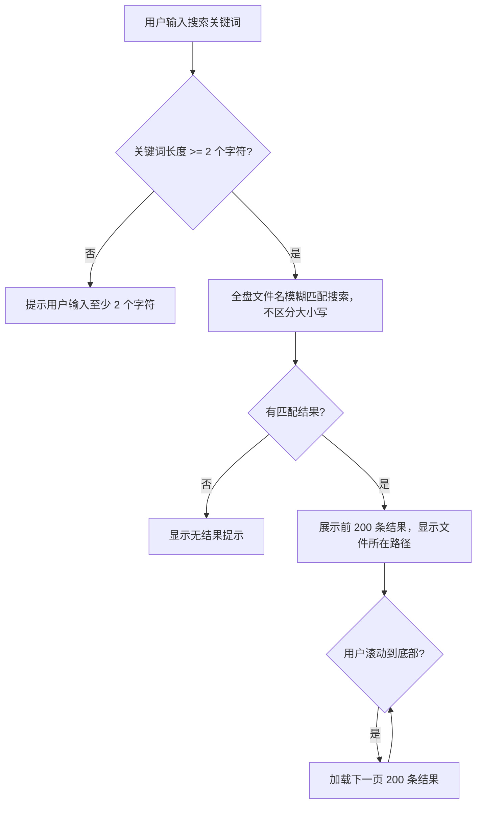

# MVP 需求文档

## 简介

个人网盘系统 MVP 版本，基于完整需求裁剪，聚焦核心闭环功能。目标是以最小可用产品验证核心用户体验：用户能够注册登录、上传下载文件、管理文件夹、搜索和预览文件。系统以客户端形式交付，支持 Windows（10 及以上）和 macOS（12 Monterey 及以上）平台。

## MVP 范围说明

### 包含的功能（核心闭环）

| MVP 需求             | 对应完整需求 | 裁剪说明                                                                                 |
| -------------------- | ------------ | ---------------------------------------------------------------------------------------- |
| 用户注册             | 需求 1       | 完整保留                                                                                 |
| 用户登录与认证       | 需求 2       | 保留登录/退出，保留 Token 刷新                                                           |
| 用户个人信息管理     | 需求 3       | 完整保留                                                                                 |
| 文件上传             | 需求 4       | 保留分片上传、断点续传、秒传、拖拽上传、进度显示、暂停/取消/重试                         |
| 文件下载             | 需求 5       | 保留分片下载、断点续传、进度显示、暂停/取消/重试，去掉文件夹打包下载                     |
| 文件夹管理           | 需求 6       | 保留创建、重命名、删除（直接删除，不进回收站）、移动、排序、文件详情、复制、同名冲突处理 |
| 文件预览             | 需求 9       | 仅支持图片和文档预览，去掉视频和音频                                                     |
| 文件搜索             | 需求 11      | 仅保留全盘文件名搜索，去掉筛选；搜索结果分页加载，每页 200 条                            |
| 存储空间管理         | 需求 10      | 完整保留                                                                                 |
| 海量文件处理与高性能 | 需求 12      | 完整保留                                                                                 |

## 术语表

- **Cloud_Drive_Client**: 个人网盘客户端应用程序，用户通过该客户端与云端存储服务交互
- **Auth_Service**: 认证服务，负责用户登录、令牌签发与验证
- **Upload_Engine**: 上传引擎，负责文件分片、断点续传及并发上传调度
- **Download_Engine**: 下载引擎，负责文件分片下载、断点续传及并发下载调度
- **File_Manager**: 文件管理器，负责文件夹的创建，以及文件与文件夹的删除、重命名、移动和查询操作
- **Preview_Service**: 预览服务，负责生成和展示文件预览内容
- **File_Chunk**: 文件分片，将大文件拆分为固定大小的数据块用于传输
- **Access_Token**: 访问令牌，用户登录后由 Auth_Service 签发的身份凭证

## 边界规则

### 用户与认证

| 参数                | 边界值                          |
| ------------------- | ------------------------------- |
| 用户名长度          | 最少 3 个字符，最多 32 个字符   |
| 密码长度            | 最少 8 个字符，最多 64 个字符   |
| 密码复杂度          | 必须同时包含字母和数字          |
| 昵称长度            | 最少 1 个字符，最多 32 个字符   |
| Access_Token 有效期 | 2 小时                          |
| 刷新令牌有效期      | 30 天                           |
| 登录失败锁定阈值    | 连续 5 次失败后锁定账户 15 分钟 |
| 头像文件格式        | JPG、PNG                        |
| 头像文件大小上限    | 5MB                             |

### 文件与文件夹

| 参数                     | 边界值                             |
| ------------------------ | ---------------------------------- |
| 文件名/文件夹名最大长度  | 255 个字符                         |
| 文件夹最大嵌套深度       | 20 层                              |
| 单个文件大小上限         | 20GB                               |
| File_Chunk 分片大小      | 5MB                                |
| 单次批量上传文件数量上限 | 5000 个                            |
| 搜索关键词最小长度       | 2 个字符                           |
| 搜索结果上限             | 每页加载 200 条，支持滚动加载更多  |
| 预览文件大小上限         | 50MB                               |
| 批量操作异步处理阈值     | 超过 1000 个文件时采用异步任务队列 |

### 传输相关

| 参数           | 边界值 |
| -------------- | ------ |
| 默认并发上传数 | 3 个   |
| 默认并发下载数 | 3 个   |

### 存储与配额

| 参数             | 边界值           |
| ---------------- | ---------------- |
| 用户默认存储配额 | 10GB             |
| 存储空间警告阈值 | 已用空间超过 90% |

### 行为规则

| 场景                          | 规则                                                                       |
| ----------------------------- | -------------------------------------------------------------------------- |
| 上传 - 文件同名冲突（单文件） | 目标目录已存在同名文件，拒绝上传并提示文件名重复                           |
| 上传 - 文件同名冲突（批量）   | 重名文件提示上传失败，其余文件继续上传                                     |
| 复制 - 文件同名冲突           | 目标目录已存在同名文件，拒绝复制并提示文件名重复                           |
| 复制 - 文件夹同名冲突         | 目标目录已存在同名文件夹，拒绝复制并提示文件夹名重复                       |
| 复制 - 自身目录校验           | 不允许将文件夹复制到自身或其子目录下，拒绝操作并提示                       |
| 移动 - 文件同名冲突           | 目标目录已存在同名文件，拒绝移动并提示文件名重复                           |
| 移动 - 文件夹同名冲突         | 目标目录已存在同名文件夹，拒绝移动并提示文件夹名重复                       |
| 新建文件夹 - 同名冲突         | 目标目录已存在同名文件夹，拒绝创建并提示文件夹名重复                       |
| 重命名 - 同名冲突             | 同一目录下已存在同名文件或文件夹，拒绝重命名并提示名称重复                 |
| 删除后空间释放                | 直接删除后立即释放存储空间，已用配额实时更新                               |
| 搜索大小写                    | 搜索不区分大小写                                                           |
| 搜索范围                      | 搜索结果包含文件和文件夹                                                   |
| 秒传 - 无同名冲突             | 秒传完成后文件立即出现在目标目录的文件列表中，进度直接显示 100%            |
| 秒传 - 文件同名冲突（单文件） | 目标目录已存在同名文件，拒绝秒传并提示文件名重复                           |
| 秒传 - 文件同名冲突（批量）   | 重名文件秒传失败，其余文件继续秒传                                         |
| 失败任务处理                  | 上传或下载任务失败后，用户可在传输列表中重新发起该任务                     |
| 默认排序规则                  | 文件列表默认按修改时间降序排列，文件夹排在文件前面                         |
| 取消上传后的清理              | 用户取消上传任务后，客户端通知服务端清理已上传的分片数据，释放临时存储空间 |
| 取消下载后的清理              | 用户取消下载任务后，客户端清理本地已下载的临时分片数据，释放本地磁盘空间   |

## 核心业务流程

### 文件上传流程

### 文件下载流程

### 登录认证流程

### 文件夹管理流程（移动/复制）

### 文件搜索流程

## 非功能性需求

### 客户端环境要求

| 参数             | 要求              |
| ---------------- | ----------------- |
| Windows 最低版本 | Windows 10        |
| macOS 最低版本   | macOS 12 Monterey |

### 错误处理与网络异常

1. THE Cloud_Drive_Client SHALL 在网络断开时显示统一的离线状态提示，并在网络恢复后自动重连
2. THE Cloud_Drive_Client SHALL 对所有服务端请求设置超时时间（默认 30 秒），超时后向用户显示明确的错误提示并提供重试选项
3. THE Cloud_Drive_Client SHALL 对网络请求失败采用指数退避重试策略（最多重试 3 次），避免频繁请求导致服务端压力

### 本地缓存管理

1. THE Cloud_Drive_Client SHALL 限制本地文件列表缓存大小上限为 100MB
2. WHEN 本地缓存超过上限, THE Cloud_Drive_Client SHALL 按 LRU（最近最少使用）策略自动清理旧缓存
3. THE Cloud_Drive_Client SHALL 支持用户在设置中手动清理本地缓存

## 需求

### 需求 1：用户注册

**用户故事：** 作为新用户，我希望能够注册账号，以便使用个人网盘服务。

#### 验收标准

1. WHEN 用户提交有效的用户名、密码和邮箱, THE Auth_Service SHALL 创建新账号并立即激活，允许用户直接登录
2. WHEN 用户提交的用户名已存在, THE Auth_Service SHALL 返回用户名已被占用的错误信息
3. WHEN 用户提交的密码不符合强度要求（少于 8 位或不包含字母和数字）, THE Auth_Service SHALL 拒绝注册并提示密码规则
4. WHEN 用户提交的邮箱格式无效, THE Auth_Service SHALL 拒绝注册并提示正确的邮箱格式

### 需求 2：用户登录与认证

**用户故事：** 作为用户，我希望能够安全地登录网盘客户端，以便访问我的个人文件。

#### 验收标准

1. WHEN 用户提交有效的用户名和密码, THE Auth_Service SHALL 验证凭据并签发 Access_Token
2. WHEN 用户提交无效的用户名或密码, THE Auth_Service SHALL 返回明确的认证失败错误信息
3. WHEN Access_Token 过期, THE Auth_Service SHALL 支持使用刷新令牌获取新的 Access_Token
4. IF 用户连续 5 次登录失败, THEN THE Auth_Service SHALL 锁定该账户 15 分钟
5. THE Cloud_Drive_Client SHALL 在本地安全存储 Access_Token，避免明文保存
6. WHEN 用户点击退出登录, THE Cloud_Drive_Client SHALL 清除本地存储的 Access_Token 和刷新令牌，并跳转到登录页面
7. WHEN 用户退出登录, THE Auth_Service SHALL 将当前 Access_Token 加入失效列表，防止被继续使用
8. THE Cloud_Drive_Client SHALL 支持"记住密码"功能，勾选后下次登录自动填充用户名和密码
9. WHEN 用户勾选"记住密码", THE Cloud_Drive_Client SHALL 使用操作系统提供的安全存储机制（如 macOS Keychain、Windows Credential Manager）加密保存密码，禁止明文存储
10. THE Cloud_Drive_Client SHALL 支持"自动登录"功能，勾选后在刷新令牌有效期内自动完成登录，无需手动输入凭据

### 需求 3：用户个人信息管理

**用户故事：** 作为用户，我希望能够管理我的个人账号信息，以便保持账号安全和个性化设置。

#### 验收标准

1. WHEN 用户提交当前密码和新密码, THE Auth_Service SHALL 验证当前密码正确后更新为新密码
2. WHEN 用户提交的新密码与当前密码相同, THE Auth_Service SHALL 拒绝修改并提示新密码不能与旧密码相同
3. WHEN 用户上传新头像, THE Cloud_Drive_Client SHALL 支持裁剪图片并保存为用户头像
4. WHEN 用户上传的头像文件格式不是 JPG 或 PNG，或文件大小超过 5MB, THE Cloud_Drive_Client SHALL 拒绝上传并提示格式或大小要求
5. WHEN 用户修改昵称, THE Auth_Service SHALL 更新用户昵称并在客户端界面实时刷新显示

### 需求 4：文件上传

**用户故事：** 作为用户，我希望能够上传文件到网盘，以便在云端安全存储我的数据。

#### 验收标准

1. WHEN 用户选择文件进行上传且文件大小不超过 5MB, THE Upload_Engine SHALL 直接上传整个文件
2. WHEN 用户选择文件进行上传且文件大小超过 5MB, THE Upload_Engine SHALL 将文件拆分为固定大小的 File_Chunk 进行分片传输
3. WHEN 上传过程中网络中断, THE Upload_Engine SHALL 记录已上传的 File_Chunk，在网络恢复后从断点继续上传
4. THE Upload_Engine SHALL 支持同时上传多个文件，并发数量可配置（默认 3 个）
5. WHEN 所有 File_Chunk 上传完成, THE Upload_Engine SHALL 通知服务端合并分片并验证文件完整性（MD5 校验）
6. THE Upload_Engine SHALL 在上传过程中实时显示每个文件的上传进度百分比
7. WHEN 用户上传的文件与云端已有文件的 MD5 值相同, THE Upload_Engine SHALL 执行秒传操作，跳过实际数据传输
8. WHEN 用户将文件拖拽到客户端窗口, THE Cloud_Drive_Client SHALL 自动触发上传流程，将文件上传到当前浏览的目录
9. WHEN 用户通过点击上传按钮选择文件, THE Cloud_Drive_Client SHALL 允许用户选择目标上传路径，默认为当前浏览的目录
10. THE Upload_Engine SHALL 支持用户暂停、取消和重试上传任务
11. WHEN 用户取消上传任务, THE Upload_Engine SHALL 通知服务端清理已上传的分片数据，释放临时存储空间
12. THE Cloud_Drive_Client SHALL 提供传输列表视图，集中展示所有上传和下载任务的状态与进度
13. WHEN 用户发起上传, THE Upload_Engine SHALL 先校验用户剩余存储配额是否足够容纳待上传文件，配额不足时拒绝上传并提示用户清理空间

### 需求 5：文件下载

**用户故事：** 作为用户，我希望能够高效地从网盘下载文件，以便在本地使用。

#### 验收标准

1. WHEN 用户选择文件进行下载, THE Download_Engine SHALL 支持多线程分片下载以提升下载速度
2. WHEN 下载过程中网络中断, THE Download_Engine SHALL 记录已下载的分片，在网络恢复后从断点继续下载
3. THE Download_Engine SHALL 支持同时下载多个文件，并发数量可配置（默认 3 个）
4. THE Download_Engine SHALL 在下载过程中实时显示每个文件的下载进度百分比和预估剩余时间
5. WHEN 下载完成, THE Download_Engine SHALL 验证文件完整性（MD5 校验），确保下载文件与云端文件一致
6. THE Cloud_Drive_Client SHALL 支持设置默认下载路径，用户可在设置中修改，默认为系统下载目录
7. THE Download_Engine SHALL 支持用户暂停、取消和重试下载任务
8. WHEN 用户取消下载任务, THE Download_Engine SHALL 清理本地已下载的临时分片数据，释放本地磁盘空间
9. WHEN 用户发起下载, THE Download_Engine SHALL 先校验本地磁盘剩余空间是否足够容纳待下载文件，空间不足时拒绝下载并提示用户释放本地磁盘空间

### 需求 6：文件夹管理

**用户故事：** 作为用户，我希望能够创建和管理文件夹，以便有序地组织我的文件。

#### 验收标准

1. WHEN 用户指定文件夹名称和路径, THE File_Manager SHALL 在指定路径下创建新文件夹
2. WHEN 用户创建文件夹时目标路径的嵌套深度已达到 20 层上限, THE File_Manager SHALL 拒绝创建并提示用户已达最大嵌套深度
3. WHEN 用户重命名文件或文件夹, THE File_Manager SHALL 更新名称并保持文件内容和子目录结构不变
4. WHEN 用户删除文件或文件夹, THE File_Manager SHALL 直接删除该文件或文件夹；删除非空文件夹时须弹出二次确认提示，告知用户将永久删除文件夹内所有内容
5. WHEN 用户移动文件或文件夹到新路径, THE File_Manager SHALL 更新文件路径并保持文件内容完整
6. WHEN 用户尝试将文件夹移动或复制到自身或其子目录下, THE File_Manager SHALL 拒绝操作并提示不允许将文件夹移动或复制到自身内部
7. THE File_Manager SHALL 支持按名称、大小、修改时间和文件类型对文件列表进行排序，排序由服务端执行以确保分页场景下的全局排序正确性
8. THE File_Manager SHALL 支持查看文件或文件夹的详细信息，包括文件名、大小、类型、上传时间、修改时间和 MD5 值
9. WHEN 用户在文件名或文件夹名中使用非法字符（如 / \ : \* ? " < > |）, THE File_Manager SHALL 拒绝操作并提示合法的命名规则
10. IF 新建、重命名或移动时目标路径已存在同名文件夹, THEN THE File_Manager SHALL 拒绝操作并提示文件夹名重复
11. IF 复制时目标路径已存在同名文件夹, THEN THE File_Manager SHALL 拒绝操作并提示文件夹名重复
12. WHEN 用户移动或复制文件到目标路径且目标路径已存在同名文件, THE File_Manager SHALL 拒绝操作并提示文件名重复
13. WHEN 用户复制文件或文件夹到目标路径, THE File_Manager SHALL 在目标路径创建副本并保持原文件内容不变
14. WHEN 用户发起复制操作, THE File_Manager SHALL 先校验用户剩余存储配额是否足够容纳副本文件，配额不足时拒绝复制并提示用户清理空间

### 需求 7：文件预览（对应完整需求 9）

**用户故事：** 作为用户，我希望能够在线预览文件内容，以便无需下载即可查看文件。

#### 验收标准

1. THE Preview_Service SHALL 支持预览以下格式的文件：图片（JPG、PNG、GIF、BMP、WebP）、文档（PDF、TXT、Markdown）
2. WHEN 用户请求预览图片文件, THE Preview_Service SHALL 在 2 秒内加载并显示图片缩略图
3. WHEN 用户请求预览文档文件, THE Preview_Service SHALL 渲染文档内容并支持翻页浏览
4. IF 文件格式不在支持的预览列表中, THEN THE Preview_Service SHALL 显示文件基本信息（文件名、大小、类型、修改时间）并提供下载按钮
5. IF 文件大小超过 50MB, THEN THE Preview_Service SHALL 拒绝在线预览并提示用户下载后查看，避免客户端内存溢出

### 需求 8：文件搜索（对应完整需求 11）

**用户故事：** 作为用户，我希望能够快速搜索文件，以便在大量文件中定位目标文件。

#### 验收标准

1. WHEN 用户输入关键词进行搜索, THE File_Manager SHALL 支持在全盘范围内按文件名进行模糊匹配搜索，首次返回 200 条结果，用户滚动到底部时自动加载下一页
2. WHEN 用户输入的搜索关键词少于 2 个字符, THE File_Manager SHALL 拒绝搜索并提示用户输入至少 2 个字符
3. THE File_Manager SHALL 在搜索结果中显示文件所在路径，方便用户定位文件位置

### 需求 9：存储空间管理（对应完整需求 10）

**用户故事：** 作为用户，我希望能够了解和管理我的存储空间使用情况，以便合理规划文件存储。

#### 验收标准

1. THE Cloud_Drive_Client SHALL 在界面上实时显示用户已用空间和总配额
2. WHEN 用户已用空间超过总配额的 90%, THE Cloud_Drive_Client SHALL 显示存储空间不足的警告提示
3. WHEN 用户已用空间达到总配额上限, THE Upload_Engine SHALL 拒绝新的上传请求并提示用户清理空间
4. THE Cloud_Drive_Client SHALL 展示各文件类型（图片、视频、文档、其他）的空间占用分布
5. WHEN 用户通过秒传方式上传文件, THE Upload_Engine SHALL 依然将该文件大小计入用户个人存储配额

### 需求 10：海量文件处理与高性能（对应完整需求 12）

**用户故事：** 作为用户，我希望网盘在处理大量文件时依然保持流畅，以便高效管理我的数据。

#### 验收标准

1. WHEN 文件夹包含超过 10000 个文件, THE File_Manager SHALL 采用分页加载策略，每页加载 100 条记录
2. THE Cloud_Drive_Client SHALL 对文件列表数据进行本地缓存，减少重复请求
3. WHEN 用户搜索文件, THE File_Manager SHALL 在 1 秒内返回搜索结果（基于文件名模糊匹配）
4. THE Upload_Engine SHALL 支持上传单个大小不超过 20GB 的文件
5. THE Cloud_Drive_Client SHALL 支持管理总量不少于 10 万个文件的存储空间
6. WHEN 用户批量操作（移动、删除、复制）超过 1000 个文件, THE File_Manager SHALL 采用异步任务队列处理并实时显示操作进度
